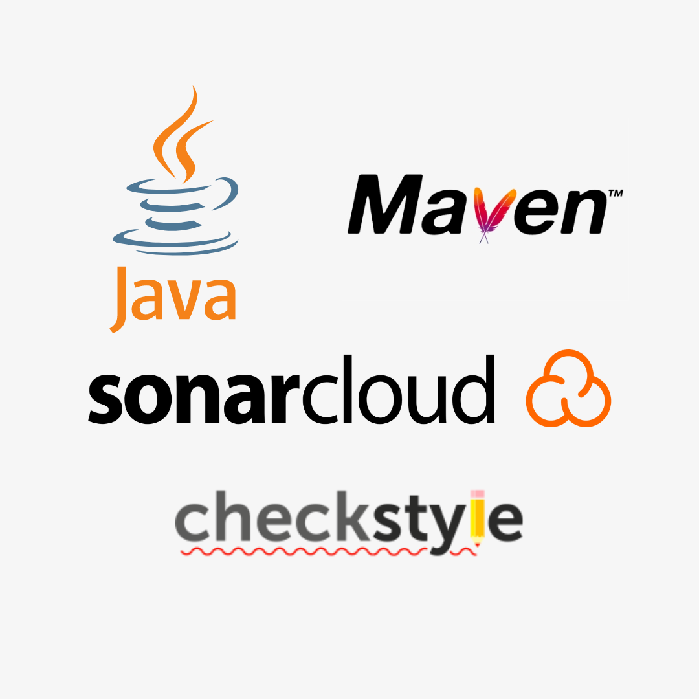
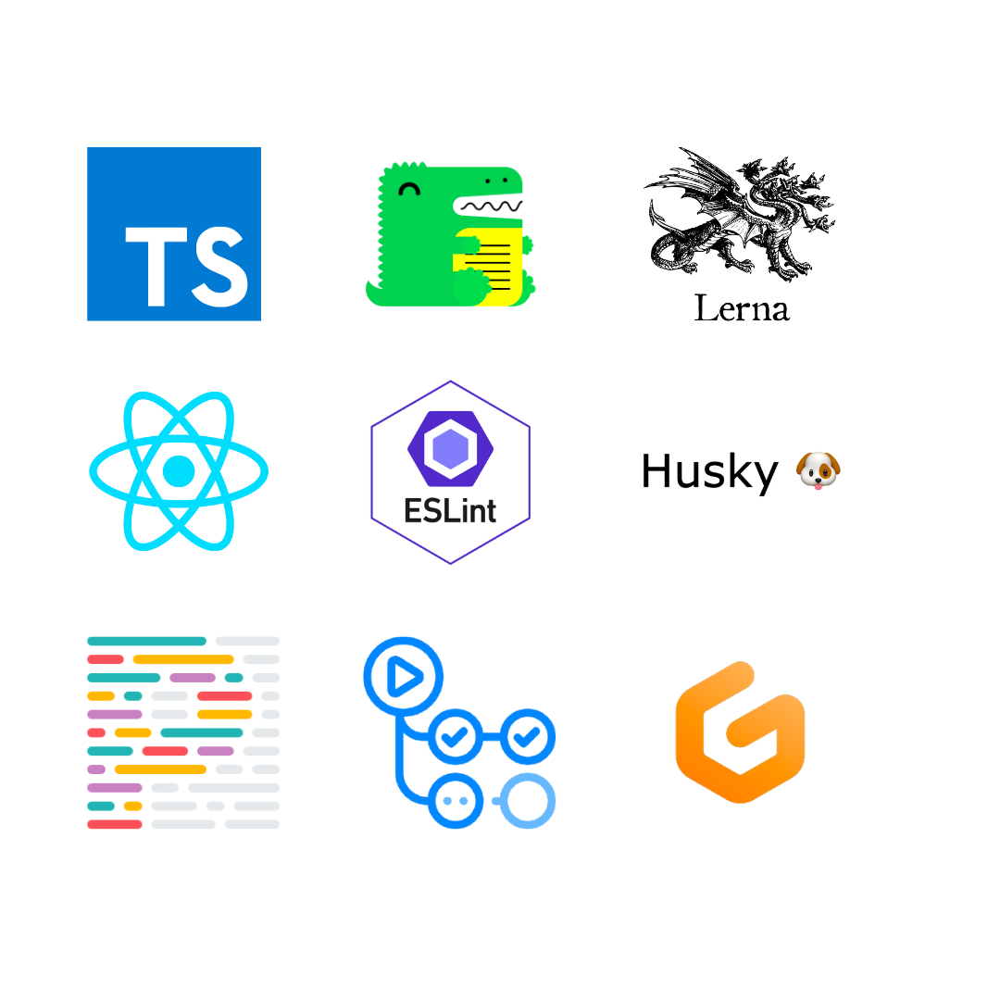
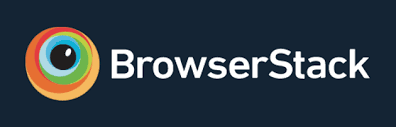

<div align="center">

  

  <h2>
    🎉 Ultimate test automation for testing any application on any platform
  </h2>
  <h3>
    Don't forget to ⭐ the repository if you like it!
  </h3>

<!-- Badges -->
<p>

[](https://www.producthunt.com/posts/boyka-framework?utm_source=badge-featured&utm_medium=badge&utm_souce=badge-boyka&#0045;framework)

[](https://gitpod.io/#https://github.com/WasiqBhamla/boyka-framework)

  <a href="https://discord.gg/dUg8K9DAsR">
    
  </a>
  <a href="https://github.com/WasiqBhamla/boyka-framework/graphs/contributors">
    
  </a>
  <a href="https://github.com/WasiqBhamla/boyka-framework/commits/main">
    
  </a>
  <a href="https://mvnrepository.com/artifact/com.github.wasiqb.boyka/boyka-framework">
    
  </a>
  <a href="https://github.com/WasiqBhamla/boyka-framework/releases/tag/v0.8.1">
    
  </a>
  <a href="https://github.com/WasiqBhamla/boyka-framework/blob/master/LICENSE">
    
  </a>
</p>

  <h4>
    <a href="https://wasiqbhamla.github.io/boyka-framework/docs/intro">Documentation</a>
  <span> · </span>
    <a href="https://github.com/WasiqBhamla/boyka-framework/issues/new/choose">Report Bug</a>
  <span> · </span>
    <a href="https://github.com/WasiqBhamla/boyka-framework/issues/new/choose">Request Feature</a>
  </h4>
</div>

<br />

## 🤔 Why was Boyka-framework created?

In my career having vast experience in automating API, Web browsers and Mobile apps, I have seen that people had to use different frameworks for automating API, Web and Mobile applications which created a lot of chaos with respect to maintenance of dependencies and their respective code for test automation.

Also, I never came across a test automation framework which allowed us to write automation test script without any project specific boilerplate code or a mini framework.

In addition to this, there was learning curve involved for learning those individual frameworks which slowed down the team to write automation and thus increased overall automation debt.

This all gave me an idea of having a single framework which could solve all the above mentioned problems and help the QA's to keep the pace up with writing test scripts and reduce the automation debt.

## 🎯 Features

- ✅ Zero boilerplate code
- ✅ Support Rest API automation with schema validations and response body verification
- ✅ Supports Web browser automation with support for Chrome, Edge, Firefox and Safari.
- ✅ Supports execution of Web tests on cloud platforms like BrowserStack and LambdaTest.
- ✅ Highly configurable via `boyka-config.json`
- ✅ Micro logging to log events of the test execution
- ✅ Supports taking screenshots

## ⏱️ Coming soon

Following are the awesome features which will be implemented soon to the frameworks:

- Support for Android automation
- Support for iOS automation
- Support for GraphQL and SOAP API automation
- Support video recording of the tests for Web and Mobile platforms
- Support for more cloud platforms.
- Many many more...

## 👀 Usage

Use this space to tell a little more about your project and how it can be used. Show additional screenshots, code samples, demos or link to other resources.

```xml
<dependency>
  <groupId>com.github.wasiqb.boyka</groupId>
  <artifactId>boyka-framework</artifactId>
  <version>0.9.0</version>
</dependency>
```

## 🤓 Sample Code snippets

<details>
  <summary>🛠️ Boyka Config file</summary>

This is the configuration file for Boyka Framework named `boyka-config.json` stored at `src/test/resources` folder.

```json
{
  "ui": {
    "timeout": {
      "implicit_wait": 10,
      "explicit_wait": 30,
      "page_load_timeout": 30,
      "script_timeout": 10
    },
    "screenshot": {
      "enabled": true,
      "path": "./screenshots",
      "extension": "jpeg",
      "prefix": "SCR"
    },
    "web": {
      "test_local_chrome": {
        "browser": "CHROME",
        "resize": "CUSTOM"
      },
      "test_local_firefox": {
        "browser": "FIREFOX"
      },
      "test_local_edge": {
        "browser": "EDGE"
      },
      "test_local_safari": {
        "browser": "SAFARI"
      },
      "test_browserstack_chrome": {
        "browser": "REMOTE",
        "cloud": "BROWSER_STACK",
        "protocol": "HTTPS",
        "host": "hub-cloud.browserstack.com",
        "user_name": "${env:BS_USER}",
        "password": "${env:BS_KEY}",
        "capabilities": {
          "browser": "Chrome",
          "browser_version": "latest",
          "os": "Windows",
          "os_version": "10",
          "resolution": "1920x1080",
          "project": "Test Boyka Project",
          "build": "Test BrowserStack Build",
          "name": "Test BrowserStack Session"
        }
      },
      "test_selenium_grid": {
        "browser": "REMOTE",
        "cloud": "NONE",
        "port": "4444",
        "capabilities": {
          "browserName": "chrome",
          "platform": "MAC"
        }
      },
      "test_lambda_test_chrome": {
        "browser": "REMOTE",
        "cloud": "LAMBDA_TEST",
        "protocol": "HTTPS",
        "host": "hub.lambdatest.com",
        "user_name": "${env:LT_USER}",
        "password": "${env:LT_KEY}",
        "capabilities": {
          "browserName": "Chrome",
          "version": "99.0",
          "platform": "Windows 10",
          "resolution": "1920x1080",
          "build": "Test LambdaTest Build",
          "name": "Test LambdaTest Session",
          "network": true,
          "visual": true,
          "video": true,
          "console": true
        }
      }
    }
  },
  "api": {
    "test_reqres": {
      "base_uri": "https://reqres.in",
      "base_path": "/api",
      "read_timeout": 2,
      "write_timeout": 2,
      "connection_timeout": 1,
      "logging": {
        "request": true,
        "response": true
      },
      "schema_path": "schema/"
    }
  }
}
```

</details>

<details>
  <summary>🪢 API Sample</summary>

Add your response schema JSON files at the directory mentioned in config under `src/test/resources` folder.

```bash
-| /src
 |__ /test
   |__ /resources
     |__ /schemas  # This folder path mentioned in config file.
       |__ create-user-schema.json
```

Here's how you can execute the API test and also verify its response.

```java
// Create request body object
final User user = User.createUser ()
  .name ("Wasiq")
  .job ("Software Engineer")
  .create ();

// Compose request
final ApiRequest request = ApiRequest.createRequest ()
  .configKey (API_CONFIG_KEY)
  .method (POST)
  .path ("/users")
  .bodyObject (user)
  .create ();

// Execute request
final ApiResponse response = ApiManager.execute (request);

// Verify response status code
response.verifyStatusCode ()
  .isEqualTo (201);

// Verify response schema
response.verifySchema ("create-user-schema.json");

// Verify response body
response.verifyTextField ("id")
  .isNotNull ();
response.verifyTextField ("name")
  .isEqualTo (user.getName ());
response.verifyTextField ("job")
  .isEqualTo (user.getJob ());
response.verifyTextField ("createdAt")
  .isNotNull ();
```

</details>

<details>
  <summary>💻 Web Sample</summary>

This is how we can create page object.

```java
package com.github.wasiqb.boyka.testng.web.saucedemo.pages;

import com.github.wasiqb.boyka.builders.Locator;
import org.openqa.selenium.By;
import lombok.Getter;

@Getter
public class LoginPage {
  public static LoginPage loginPage () {
    return new LoginPage ();
  }

  private final Locator loginBox = Locator.buildLocator ()
    .web (By.id ("login_button_container"))
    .build ();
  private final Locator loginButton = Locator.buildLocator ()
    .web (By.id ("login-button"))
    .parent (this.loginBox)
    .build ();
  private final Locator password = Locator.buildLocator ()
    .web (By.id ("password"))
    .parent (this.loginBox)
    .build ();
  private final Locator username = Locator.buildLocator ()
    .web (By.id ("user-name"))
    .parent (this.loginBox)
    .build ();

  private LoginPage () {
    // Avoid explicit class initialization.
  }
}
```

And later we can use that page object to execute the test.

```java
import static com.github.wasiqb.boyka.actions.DriverActions.navigateTo;
import static com.github.wasiqb.boyka.actions.DriverActions.takeScreenshot;
import static com.github.wasiqb.boyka.actions.KeyboardActions.enterText;
import static com.github.wasiqb.boyka.actions.KeyboardActions.pressKey;
import static com.github.wasiqb.boyka.actions.MouseActions.clickOn;
import static com.github.wasiqb.boyka.actions.VerifyDriverActions.verifyBrowserTitle;
import static com.github.wasiqb.boyka.actions.VerifyDriverActions.verifyBrowserUrl;
import static com.github.wasiqb.boyka.actions.VerifyElementActions.verifyElementDisplayed;
import static com.github.wasiqb.boyka.actions.VerifyElementActions.verifyElementEnabled;
import static com.github.wasiqb.boyka.manager.DriverManager.closeDriver;
import static com.github.wasiqb.boyka.manager.DriverManager.createDriver;
import static com.github.wasiqb.boyka.testng.web.saucedemo.pages.LoginPage.loginPage;
import static java.text.MessageFormat.format;
import static org.openqa.selenium.Keys.CONTROL;
import static org.openqa.selenium.Keys.DELETE;
. . .
createDriver (ApplicationType.WEB, "test_local_chrome");
. . .
private static final String URL = "https://www.saucedemo.com";
. . .
navigateTo (URL);
verifyBrowserUrl ().startsWith (URL);

enterText (loginPage ().getUsername (), "standard_user");
pressKey (loginPage ().getUsername (), CONTROL, "a", DELETE);
enterText (loginPage ().getUsername (), "standard_user");
enterText (loginPage ().getPassword (), "secret_sauce");

clickOn (loginPage ().getLoginButton ());

verifyBrowserUrl ().isEqualTo (format ("{0}/inventory.html", URL));
verifyBrowserTitle ().isEqualTo ("Swag Labs");

verifyElementDisplayed (homePage ().getMenuButton ()).isTrue ();
verifyElementEnabled (homePage ().getMenuButton ()).isTrue ();

takeScreenshot ();
. . .
closeDriver ();
```

</details>

## ☕ Examples

- API:
  - [How to configure Boyka for API Automation?](https://wasiqbhamla.github.io/boyka-framework/docs/guides/api/setup-config)
  - [How to compose a request?](https://wasiqbhamla.github.io/boyka-framework/docs/guides/api/compose-request)
  - [How to execute a request?](https://wasiqbhamla.github.io/boyka-framework/docs/guides/api/execute-request)
  - [How to verify the response?](https://wasiqbhamla.github.io/boyka-framework/docs/guides/api/verify-response)
- Web:
  - [How to configure Boyka for Web Automation?](https://wasiqbhamla.github.io/boyka-framework/docs/guides/web/setup-config)
  - [How to create page object?](https://wasiqbhamla.github.io/boyka-framework/docs/guides/web/create-page-object)
  - [How to write test using the page object?](https://wasiqbhamla.github.io/boyka-framework/docs/guides/web/write-test)

## 👾 Tech Stack

### 🏘️ Boyka Framework

<div>
  
</div>

### 💻 Main project and Website

<div>
  
</div>

### 💎 Cloud platform supporters

Big thanks to the following organizations for their support to the project with their open source licenses:

<div align="center">
  <a href="http://www.lambdatest.com?fp_ref=wasiq95" target="_blank" style="outline:none;border:none;"></a>
  <br/>
  <a href="http://www.browserstack.com" target="_blank" style="outline:none;border:none;"></a>
</div>

## 🧭 Project Road-map

Check out our road map to know which features we are cooking,

- [Project Road-map](https://github.com/orgs/WasiqBhamla/projects/4/views/1)
- [Current Milestone](https://github.com/orgs/WasiqBhamla/projects/4/views/2)
- [Next Milestone](https://github.com/orgs/WasiqBhamla/projects/4/views/3)
- [Future planned features](https://github.com/orgs/WasiqBhamla/projects/4/views/4)

## 👋 Contributing

These are our awesome contributors:

[](https://github.com/WasiqBhamla/boyka-framework/graphs/contributors)

Contributions are always welcome!

Check out [`contributing.md`](./.github/CONTRIBUTING.md) for ways to get started.

## 📜 Code of Conduct

Please read the [Code of Conduct](./.github/CODE_OF_CONDUCT.md)

## ⚠️ License

Distributed under MIT [License](LICENSE).

## 🤝 Contact

- Join our [Discord server](https://discord.gg/dUg8K9DAsR) to discuss anything about the framework
- Open a [new Discussion](https://github.com/WasiqBhamla/boyka-framework/discussions/new) on GitHub to ask questions or to discuss ideas
- Connect with me on [my Linktree](https://linktr.ee/wasiqbhamla)

## ⭐ Star History

[](https://star-history.com/#WasiqBhamla/boyka-framework&Timeline)
