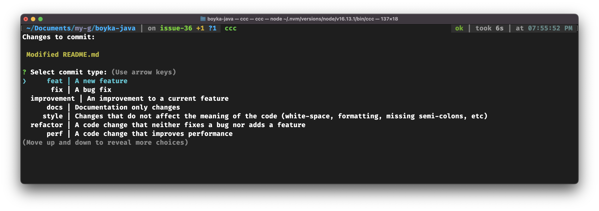
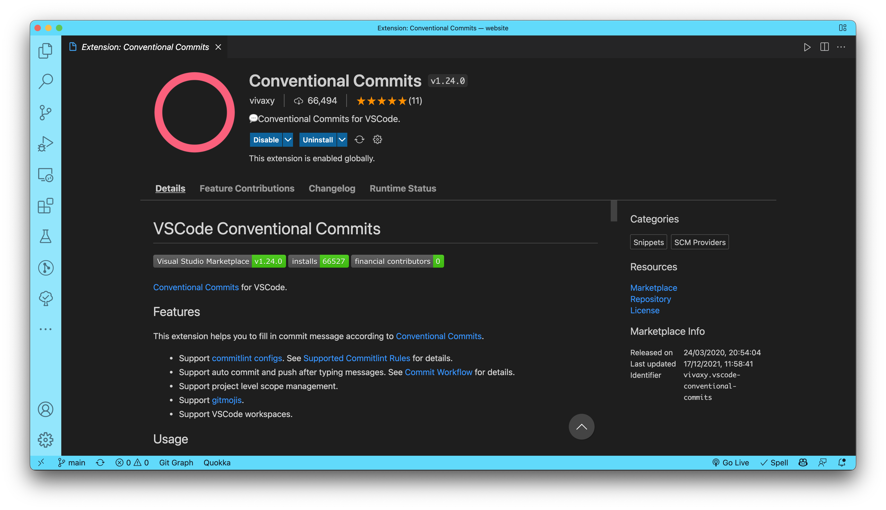

# boyka-java

Ultimate test automation for testing any application on any platform

- [boyka-java](#boyka-java)
  - [Setup](#setup)
  - [Write conventional commits](#write-conventional-commits)
    - [1. Terminal setup](#1-terminal-setup)
    - [2. VS Code extensions](#2-vs-code-extensions)
    - [3. IntelliJ IDEA extensions](#3-intellij-idea-extensions)
  - [Local commitlint Check](#local-commitlint-check)
  - [CI commit message check](#ci-commit-message-check)

## Setup

In root directory of the project, run:

```bash
> yarn install
```

## Write [conventional commits](https://www.conventionalcommits.org/en/v1.0.0/)

There are three options for writing conventional commits.

You can use any of them.

### 1. Terminal setup

On Mac OS or Linux machines, you can install [`conventional-commit-cli`](https://www.npmjs.com/package/conventional-commit-cli) globally:

```bash
> npm i -g conventional-commit-cli
```

Now, when you want to commit your changes, run:

```bash
> ccc
```

Once you run above command, you'll see a prompt to enter the commit message.

> See sample screenshot:



On Windows, we observed issues with the prompt. It's advised to use IDE extensions to write conventional commits.

### 2. VS Code extensions

Search for [`conventional-commits`](https://marketplace.visualstudio.com/items?itemName=vivaxy.vscode-conventional-commits) and install it.



Now you can use the extension to write conventional commits.

### 3. IntelliJ IDEA extensions

Search for [`Conventional Commits`](https://plugins.jetbrains.com/plugin/13389-conventional-commit) and install it.

Now you can use the extension to write conventional commits.

## Local commitlint Check

When you commit your changes, your commit message will be checked against [commitlint](https://commitlint.js.org/#/) conventional commit rules.

If the commit message does not follow the rules, you'll get an error and your commit will get rejected.

## CI commit message check

In case you bypass the commitlint check on your local machine, we have a CI job that will check the commit message on CI when you raise a PR. And if that job fails, your PR may get rejected.
