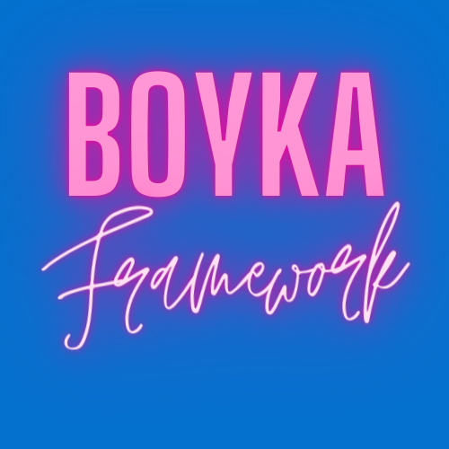
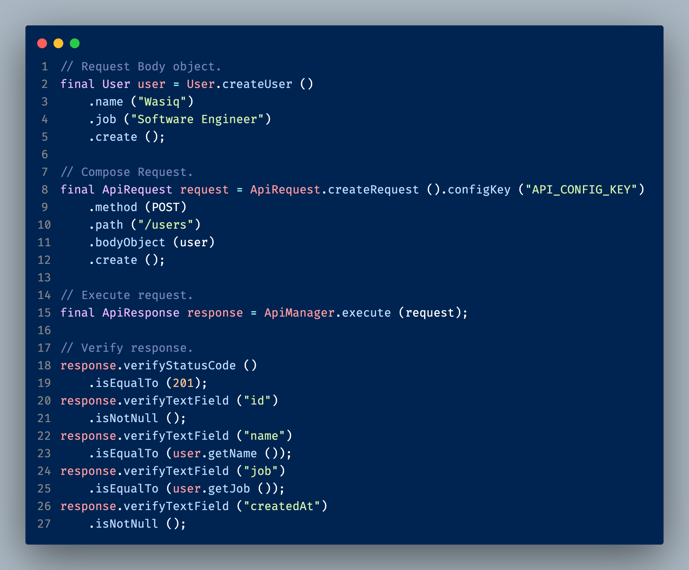
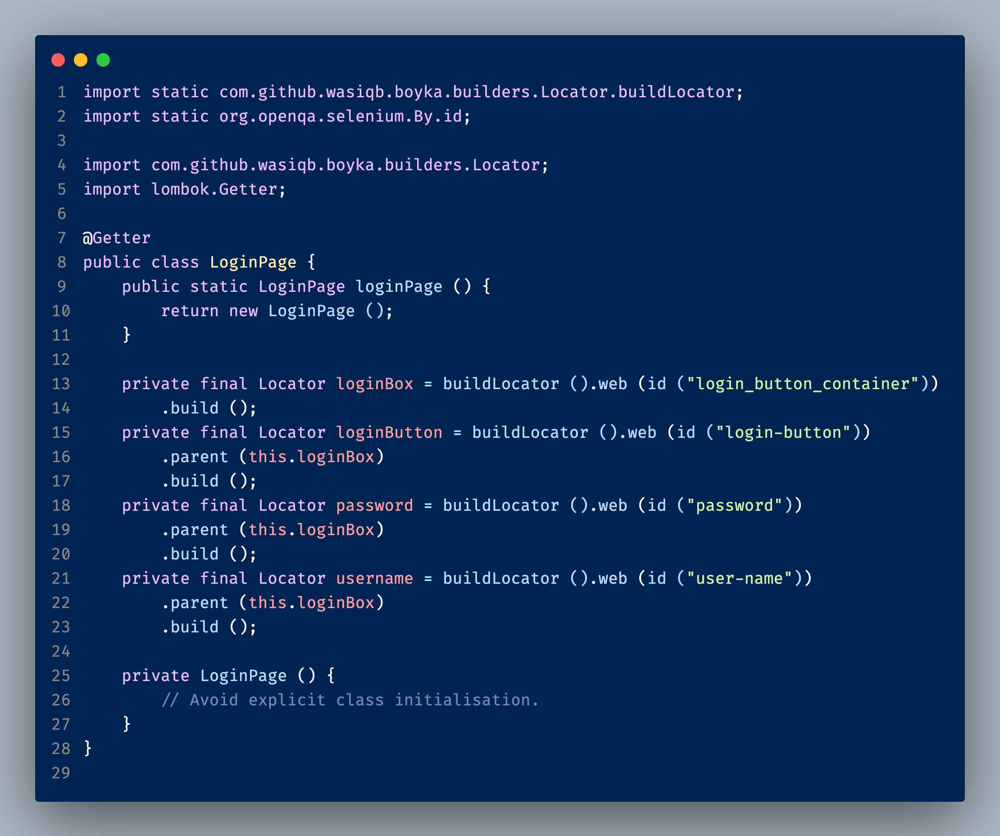
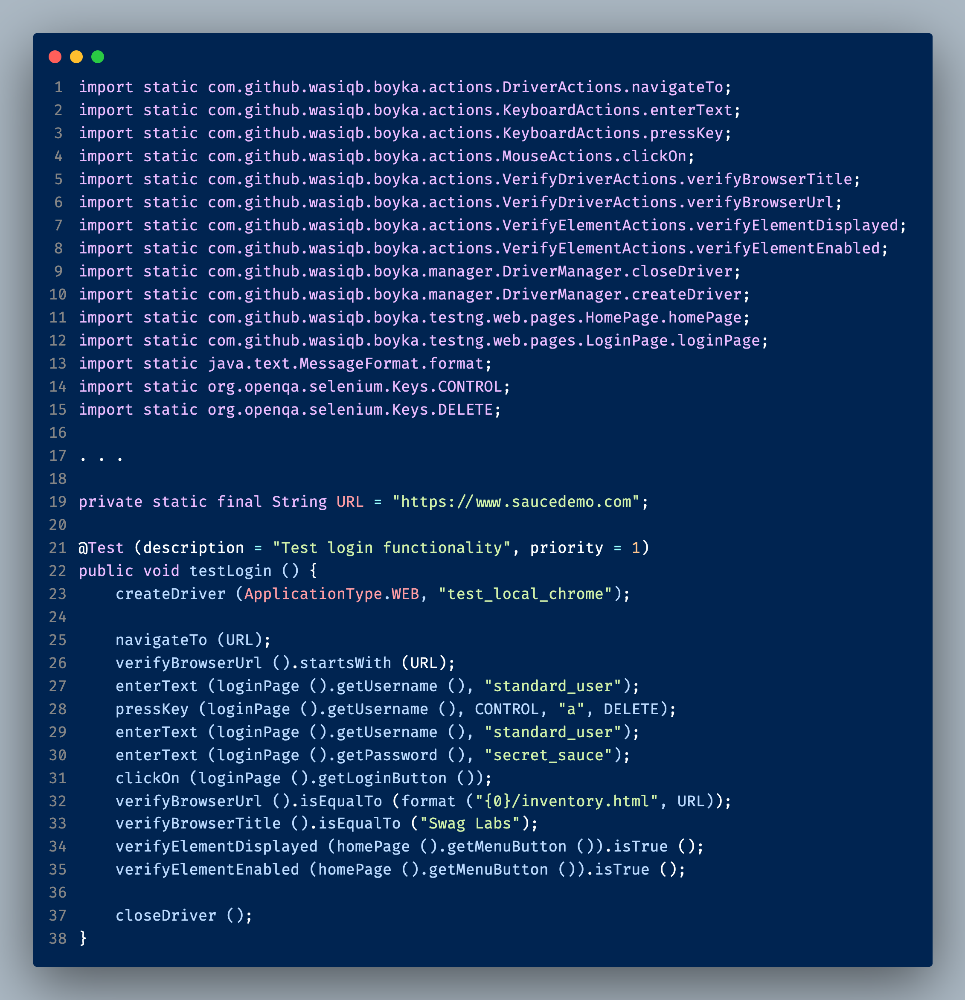
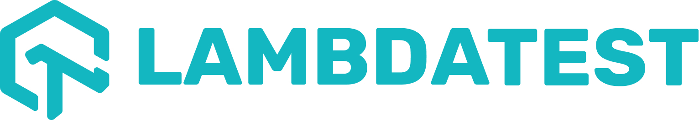

<div align="center">

  

  <h2>
    🎉 Ultimate test automation for testing any application on any platform
  </h2>
  <h3>
    Don't forget to ⭐ the repository if you like it!
  </h3>

<!-- Badges -->
<p>

  <a href="https://gitpod.io/#https://github.com/WasiqBhamla/boyka-framework">
    
  </a>
  <a href="https://discord.gg/dUg8K9DAsR">
    
  </a>
  <a href="https://github.com/WasiqBhamla/boyka-framework/graphs/contributors">
    
  </a>
  <a href="">
    
  </a>
  <a href="https://github.com/WasiqBhamla/boyka-framework/network/members">
    
  </a>
  <a href="https://github.com/WasiqBhamla/boyka-framework/stargazers">
    
  </a>
  <a href="https://github.com/WasiqBhamla/boyka-framework/issues/">
    
  </a>
  <a href="https://github.com/WasiqBhamla/boyka-framework/blob/master/LICENSE">
    
  </a>
</p>

  <h4>
    <a href="#camera-screenshots">View Demo</a>
  <span> · </span>
    <a href="https://wasiqbhamla.github.io/boyka-framework/">Documentation</a>
  <span> · </span>
    <a href="https://github.com/WasiqBhamla/boyka-framework/issues/new/choose">Report Bug</a>
  <span> · </span>
    <a href="https://github.com/WasiqBhamla/boyka-framework/issues/new/choose">Request Feature</a>
  </h4>
</div>

<br />

<!-- Table of Contents -->

# :notebook_with_decorative_cover: Table of Contents

- [:notebook_with_decorative_cover: Table of Contents](#notebook_with_decorative_cover-table-of-contents)
  - [:star2: About the Project](#star2-about-the-project)
    - [:camera: Screenshots](#camera-screenshots)
    - [:space_invader: Tech Stack](#space_invader-tech-stack)
    - [:dart: Features](#dart-features)
  - [:eyes: Usage](#eyes-usage)
  - [:compass: Roadmap](#compass-roadmap)
  - [:wave: Contributing](#wave-contributing)
    - [:scroll: Code of Conduct](#scroll-code-of-conduct)
  - [:warning: License](#warning-license)
  - [:handshake: Contact](#handshake-contact)
  - [:gem: Acknowledgements](#gem-acknowledgements)

<!-- About the Project -->

## :star2: About the Project

<!-- Screenshots -->

### :camera: Screenshots

<details>
  <summary>Boyka Config file</summary>

<div>
  
</div>

</details>

<details>
  <summary>API Sample</summary>

<div>
  
</div>

</details>

<details>
  <summary>Web Sample</summary>

<div>
  
</div>

<div>
  
</div>

</details>

<!-- TechStack -->

### :space_invader: Tech Stack

<details>
  <summary>Boyka Framework</summary>

- Java 11
- Maven
- Checkstyle
- Sonar cloud

</details>

<details>
  <summary>Documentation site</summary>

- Typescript
- Docusaurus 2
- React JS

</details>

<details>
<summary>Main project</summary>

- Typescript
- Commitlint
- ESLint
- Prettier
- Husky

</details>

<details>
<summary>DevOps</summary>

- GitHub Actions
- Gitpod

</details>

<!-- Features -->

### :dart: Features

- Supports Rest API Automation
- Supports Web Automation
- Highly configurable
- Zero boilerplate code for your projects
- Supports execution on Cloud platforms like BrowserStack, LambdaTest, etc.
- Supports Parallel execution
- Has in-built logging for all the events
- Has in-built Assertion methods

<!-- Usage -->

## :eyes: Usage

Use this space to tell a little more about your project and how it can be used. Show additional screenshots, code samples, demos or link to other resources.

```xml
<dependency>
  <groupId>com.github.wasiqb.boyka</groupId>
  <artifactId>boyka-framework</artifactId>
  <version>0.7.0</version>
</dependency>
```

<!-- Roadmap -->

## :compass: Roadmap

See our [Roadmap project](https://github.com/orgs/WasiqBhamla/projects/4/views/1) for more details.

<!-- Contributing -->

## :wave: Contributing

<a href="https://github.com/WasiqBhamla/boyka-framework/graphs/contributors">
  
</a>

Contributions are always welcome!

See [`contributing.md`](https://github.com/WasiqBhamla/boyka-framework/blob/main/.github/CONTRIBUTING.md) for ways to get started.

<!-- Code of Conduct -->

### :scroll: Code of Conduct

Please read the [Code of Conduct](https://github.com/WasiqBhamla/boyka-framework/blob/master/.github/CODE_OF_CONDUCT.md)

<!-- License -->

## :warning: License

Distributed under MIT License. See [LICENSE](LICENSE) for more information.

<!-- Contact -->

## :handshake: Contact

- Join our [Discord server](https://discord.gg/dUg8K9DAsR) to discuss anything about the framework
- Open a [new Discussion](https://github.com/WasiqBhamla/boyka-framework/discussions/new) on GitHub to ask questions or to discuss ideas
- Contact / Follow me on [Twitter @WasiqBhamla](https://twitter.com/WasiqBhamla)

<!-- Acknowledgments -->

## :gem: Acknowledgements

Big thanks to the following organizations for their support to the project with their open source licenses:

<a href="https://www.browserstack.com">
  
</a>

<a href="https://www.lambdatest.com">
  
</a>
